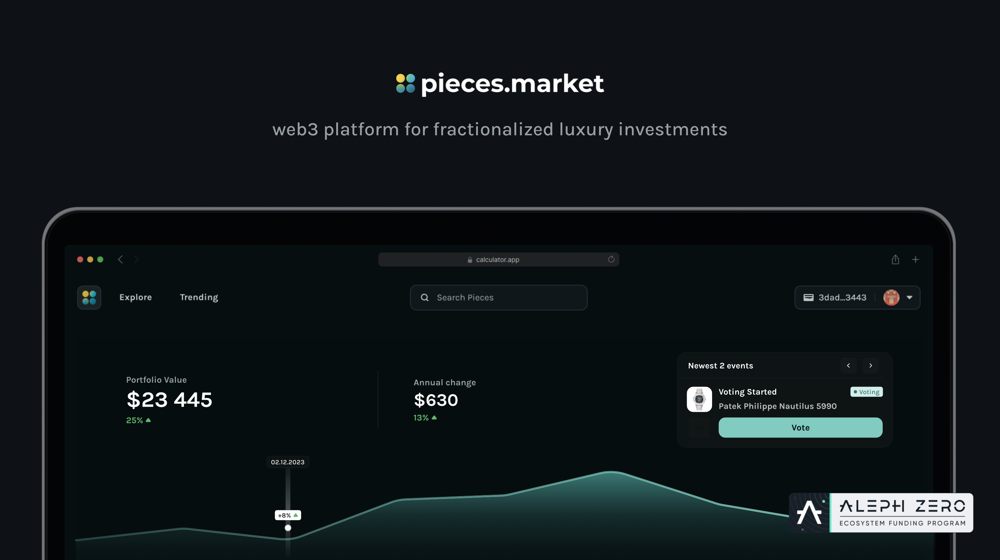
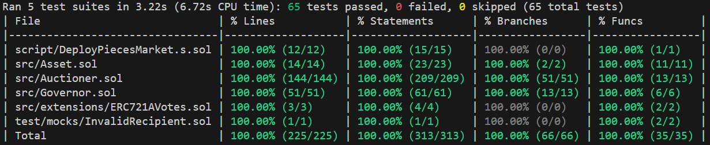

# 🔬 **What Is pieces.market?**

Web3 platform enabling fractional investment in luxury assets, allowing users to invest in high-value items such as cars, watches, and yachts starting from just $100. Whether you're a web3 degen or a newbie, pieces.market welcomes you to explore fractionalized luxury assets. With intuitive features like traditional login methods and a built-in self-custody wallet, pieces.market extends a welcoming hand to individuals new to the web3 world.

At pieces.market you can find many brokers, such as auction houses, specialized agents or producers, offering a wide selection of luxury assets from all over the world. Each broker is carefully screened and each document related to the broker or the asset is verified by independent legal officers and placed on the blockchain. Thanks to this, you can verify all the most important information about the auction and rules of asset management before purchasing.

# 🚀 **Deployments**

-   **Aleph Zero Testnet**

    -   **Auctioner:** 0x3293c12a0E0A107f8eed5517558B494c290d949b
    -   **Governor:** 0xAc8578b94a5c1A70F40ce7270ce840d0ea1AF777

-   **Sepolia:**

    -   **Auctioner:** 0x530Ec5617Db81acA931CE9B57a9CF2549f903Ef2
    -   **Governor:** 0xb30Dfc59152b458036317d3c9848C4Ed21C39003

-   **Aleph Zero Testnet Development Contracts**

    -   **Auctioner:** 0xFFDcA62c4C97fE8cCb37DBe2a3399764421D88d5, 0x7C6130CddFf24A8246240C8c453D036B30cA3584
    -   **Governor:** 0x910b3C2A72e8480326Ea94Ba07471e5A0A123Ec3, 0x61824F20307Fbe0B8205bD7bE79A4278D2cd1CfD

# 👷‍♂️ **To Implement**

-   Mock transactions on Aleph Zero testnet blockchain to reproduce all possible states of auction along with proposals and other possible transactions and branches
-   Implement fee's into 'Auctioner' 'buy' function
-   Refactor 'Auctioner' functions to check equivalent of USD value instead of native blockchain currency (we will be using Oracles to get proper price feeds here)
-   Implement Vlayer solution into 'Auctioner' 'fulfill' function to ensure cryptographic proof has been provided via email or other credentials
-   Implement Cross Chain solution
-   Consider implementing starting/minimal price for example 100 USD per piece
-   Consider refactor for 'Propose' events on 'Auctioner' and 'Governor' to keep 'ProposalType' only in one of those and avoid duplication

# 📃 **Documentation**

## <u>**Project Overview**</u>

This project is a decentralized auction system that uses smart contracts to manage auctions, mint NFTs (assets), and facilitate user interactions such as buying, proposing changes, voting on those changes, claiming revenues, and more. The system comprises several key contracts: `Auctioner`, `Asset`, and `Governor`. Whole blockchain part has been built and fully tested using `Solidity` language and `Foundry` framework. Libraries used to build this project were fully audited and are free and save to use. All contracts has been already optimized gas wise, tested and are protected with solid usage restrictions.

## <u>**Project Workflow**</u>

-   **Auction Preparation:**

    -   The auction preparation is carried out by a broker, who inputs the detailed information about the asset being auctioned and uploads all relevant investment documents associated with the investment.

-   **Auction Creation:**

    -   The Contract Owner (admin of the platform) reviews the details prepared by the broker. If the admin has no objections, the auction is approved on the platform. This approval triggers the creation of the necessary smart contracts and the upload of documents to IPFS, ensuring they are linked to the specific smart contract and enabling immutable and decentralized storage.

-   **Purchasing Pieces:**

    -   At a predefined moment, the auction opens, allowing users to purchase pieces by sending the required funds. Once all pieces are sold, the auction is automatically closed, and the funds from the sale are transferred directly to the broker.

-   **Refunds:**

    -   If the auction does not succeed (not all pieces are sold within the specified timeframe), users who participated are eligible for a refund. The amount returned to each participant is proportional to their contribution, ensuring that all funds are safely returned if the auction does not reach its goal.

-   **Proposals:**

    -   Users have the ability to propose two types of changes: buyouts or descriptive updates to the auction. These proposals are managed and voted on through the Governor contract.
        1. Buyout Proposals: Enable users to propose an immediate purchase of the entire asset by transferring the required funds.
        2. Descriptive Proposals: Allow updates to the auction’s description, but only the Foundation is permitted to make these changes.

-   **Withdrawals:**

    -   If a buyout proposal is rejected, the user who made the offer can withdraw the funds.

-   **Auction Finalization:**

    -   If the asset is sold according to the initial investment terms or through a successful buyout proposal, and the funds are deposited into the smart contract, users can claim their share of the revenue by burning the pieces they hold.

## <u>**Automation**</u>

Gelato automation system periodically checks the state of auctions and execute required functions, such as finalizing auctions updating their states etc.

## **🏛️** <u>**Auctioner Contract**</u>

The Auctioner contract is responsible for managing auctions within the platform. It includes functionality to start new auctions, place orders, and close auctions once a buying period is over. It also tracks the state of each auction and ensures that the auction rules (e.g., minimum bid increments, auction duration) are enforced. This contract interacts with assets and governs their sale or transfer based on auction outcomes.

## <u>**Auctioner Contract Structure:**</u>

### **Auction States**

-   **`UNINITIALIZED:`** Auction has not been initialized and does not exist on blockchain
-   **`SCHEDULED:`** Auction has been initialized on blockchain and awaits its start date
-   **`OPENED:`** Auction ready to get orders for asset pieces
-   **`CLOSED:`** Auction finished positively - all asset pieces sold
-   **`FAILED:`** Auction finished negatively - not all asset pieces sold in given time, buyers can refund
-   **`FINISHED:`** All funds gathered from closed auction have been transferred to broker and broker transferred revenues to contract, buyers can claim revenues
-   **`ARCHIVED:`** Everyone claimed their revenues, investment ultimately closed

### **Proposal Types**

-   **`BUYOUT:`** Proposal option to buy the entire asset instantly for a specified amount
-   **`DESCRIPT:`** Proposal option for anything typed in description

### **Auction Structure**

-   **`address asset:`** Address of NFT related to auctioned asset
-   **`uint256 price:`** Single piece of asset price
-   **`uint256 pieces:`** Total number of pieces available for sale
-   **`uint256 max:`** Maximum number of pieces one user can buy
-   **`uint256 openTs:`** Timestamp when the auction opens
-   **`uint256 closeTs:`** Timestamp when the auction ends
-   **`address recipient:`** Wallet address where funds from asset sale will be transferred
-   **`bool buyoutProposalActive:`** Boolean indicating if there is a buyout proposal in progress as there is one proposal of each type allowed at the time
-   **`bool descriptProposalActive:`** Boolean indicating if there is a descript proposal in progress as there is one proposal of each type allowed at the time
-   **`address offerer:`** Wallet address of the buyout offerer
-   **`mapping(address offerer => uint amount) offer:`** Mapping to track the amount that has been offered
-   **`mapping(address offerer => bool) withdrawAllowed:`** Mapping to track if the offerer is allowed to withdraw the offer
-   **`AuctionState state:`** Current state of the auction

### **Auction Events**

-   **`Create:`** Emitted when a new auction is created on blockchain
-   **`Schedule:`** Emitted when auction is created with open timestamp in future
-   **`Purchase:`** Emitted when pieces of an auction are bought
-   **`Propose:`** Emitted when proposal request has been sent to Governor contract
-   **`Buyout:`** Emitted when voting passes for buyout proposal
-   **`Descript:`** Emitted when voting passes for descript proposal
-   **`Reject:`** Emitted when proposal fails
-   **`Refund:`** Emitted when a refund has been executed successfully by user
-   **`Withdraw:`** Emitted when a withdraw has been executed successfully by user
-   **`Fulfill:`** Emitted when a fulfill has been executed successfully
-   **`Claim:`** Emitted when revenue is claimed from an auction
-   **`TransferToBroker:`** Emitted when funds are transferred to the broker
-   **`StateChange:`** Emitted when the state of an auction changes

### **Auction Errors**

-   **`AuctionDoesNotExist:`** Error thrown when attempting to interact with a non-existent auction
-   **`AuctionNotOpened:`** Error thrown when attempting to perform an action on an auction that hasn't opened yet
-   **`AuctionNotClosed:`** Error thrown when attempting to perform an action on an auction that hasn't closed yet
-   **`AuctionNotFailed:`** Error thrown when user tries to refund but auction is not in failed state
-   **`AuctionNotFinished:`** Error thrown when user tries to claim but auction is not in finished state
-   **`InsufficientPieces`**: Error thrown when there aren't enough pieces left to fulfill an order
-   **`InsufficientFunds:`** Error thrown when there are insufficient funds for an action
-   **`TransferFailed:`** Error thrown when a fund transfer operation fails
-   **`AuctionAlreadyInitialized:`** Error thrown when admin calls create on existing auction
-   **`ZeroValueNotAllowed:`** Error thrown when a zero value is provided as parameter where it is not allowed
-   **`IncorrectTimestamp:`** Error thrown when a provided timestamp is incorrect or invalid
-   **`ZeroAddressNotAllowed:`** Error thrown when a zero address is provided where it is not allowed
-   **`Overpayment:`** Error thrown when an overpayment is detected in buy or buyout functions
-   **`BuyLimitExceeded:`** Error thrown when the buy limit of pieces for an auction is exceeded
-   **`ProposalInProgress:`** Error thrown when there is a proposal in progress
-   **`UnauthorizedCaller:`** Error thrown when function called by unauthorized address
-   **`InvalidProposalType:`** Error thrown when function called with incorrect proposal type
-   **`IncorrectDescriptionSize:`** Error thrown when proposal description provided is too short or too long
-   **`IncorrectFundsTransfer:`** Error thrown when funds value sent to contract is too low or too high

## **📜** <u>**Asset Contract**</u>

The Asset contract represents the NFTs minted during auction creation. Each auctioned asset is minted as an NFT, with users able to buy pieces of the asset. These NFTs can be bought, transferred, and burned based on user interactions with the auction system. The Asset contract also manages the creation, storage, and transfer of assets within the auction system. It handles the minting and burning of tokens (pieces) of assets, and ensures that ownership is properly tracked throughout the lifecycle of the asset. It also implements voting system strictly connected with `Governor` contract.

Each asset is linked to IPFS (InterPlanetary File System) via a unique URI, which points to its metadata and visual representation. All assets are based on the ERC721 standard for non-fungible tokens (NFTs) and include standard functions such as mint, transfer, and burn. In this project, we are using the Azuki implementation of ERC721 (ERC721A), which significantly reduces the costs associated with minting, transferring, and burning providing the only such solution in the web3 world where, despite the fractionalization of the asset, the user receives a full-fledged NFT and not a cryptocurrency substitute, i.e. the ERC20 standard.

## **⚖️** <u>**Governor Contract**</u>

The Governor contract is responsible for managing proposals, including buyout proposals and descriptive changes to auctions. It oversees the voting process and determines whether a proposal should be accepted or rejected. Functions from this contract can only be called by the `Auctioner` contract itself, with the exception of the `castVote` function, which allows users to cast votes for each proposal if they hold any linked asset tokens.

## <u>**Governor Contract Structure:**</u>

### **Governor Proposal States**

-   **`INACTIVE:`** Proposal does not exist
-   **`ACTIVE:`** Proposal is currently open for voting
-   **`SUCCEEDED:`** Proposal successfully executed
-   **`FAILED:`** Proposal did not pass and awaits cancellation

### **Proposal Vote Types**

-   **`FOR:`** Indicates a vote in favor of the proposal
-   **`AGAINST:`** Indicates a vote against the proposal

### **Proposal Structure**

-   **`uint256 auctionId:`** The id of the auction that received offer
-   **`address asset:`** Address of the asset (NFT) linked to the proposal
-   **`uint256 voteStart:`** Timestamp when voting starts
-   **`uint256 voteEnd:`** Timestamp when voting ends
-   **`string description:`** Description of the proposal
-   **`bytes encodedFunction:`** Function to be called on execution expressed in bytes
-   **`uint256 forVotes:`** Number of votes in favor of the proposal
-   **`uint256 againstVotes:`** Number of votes against the proposal
-   **`mapping(address => bool) hasVoted:`** Mapping to track if an address has voted on the proposal
-   **`ProposalState state:`** Current state of the proposal

### **Governor Events**

-   **`Propose:`** Emitted when a new proposal is created
-   **`ProcessProposal:`** Emitted when proposal has been executed or cancelled and removed from ongoing proposals array
-   **`CastVote:`** Emitted when vote has been casted
-   **`StateChange:`** Emitted when the state of a proposal changes

### **Governor Errors**

-   **`ProposalDoesNotExist:`** Error thrown when interacting with a non-existent proposal
-   **`ProposalNotActive:`** Error thrown when attempting to vote on a non-active proposal
-   **`AlreadyVoted:`** Error thrown when attempting to vote more than once
-   **`ZeroVotingPower:`** Error thrown when a user with zero voting power attempts to vote
-   **`ExecuteFailed:`** Error thrown if execute function revert

# 🧪 **Tests**

# 🔑 **License**

    This contract is licensed under the GNU General Public License v3.0 or later.
