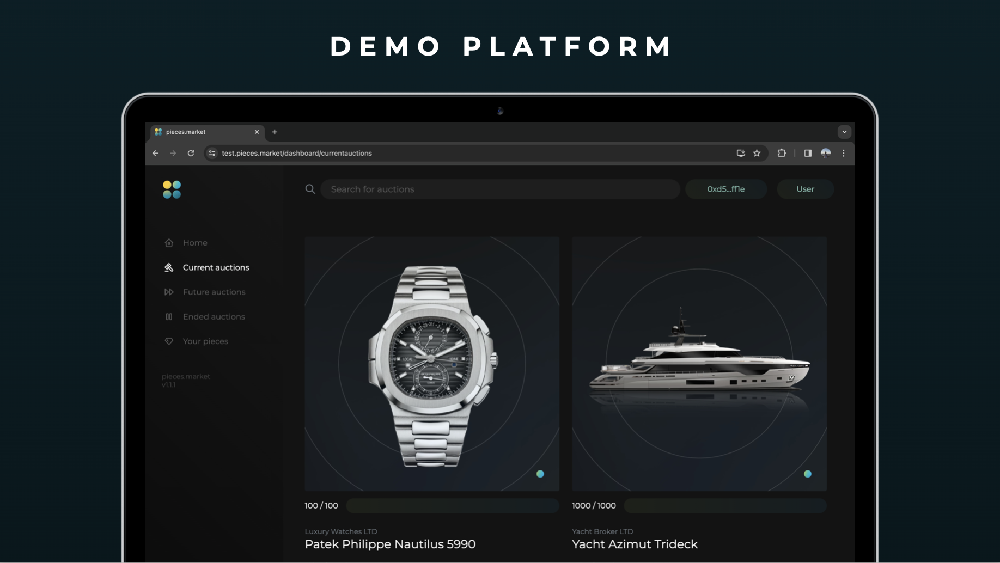
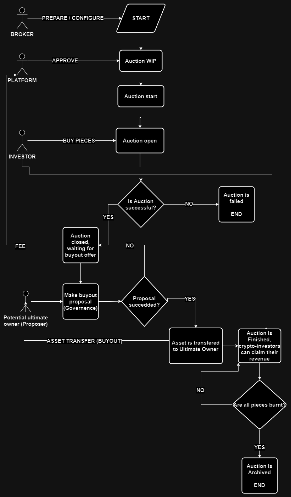

# 


[](https://choosealicense.com/licenses/gpl-3.0/)

## pieces.market MVP

**Repository for secure smart contract development.** Build on a solid foundation of community-vetted code.

 * Asset Auction [`auction.sol`](https://github.com/pieces-market/contracts/auction.sol)
 * Buyout Governor [`buyout_gov.sol`](https://github.com/pieces-market/contracts/buyout_gov.sol)

This repository contains the smart contracts used by [pieces.market](https://pieces.market) platform.
   
> [!IMPORTANT]
> Pieces.market contracts are not backward compatible, it's unsafe to assume that newer version have the same functions or state variables.
> We are still in the early phase, so follow us on social media for new updates and take part in our revolution in the luxury market.
> 

## Our mission
Revolution in access to the luxury market.

Many luxury investments are great value stores, some may even be recession-proof. They have been in investors’ crosshairs for the last few years, driving prices up and creating handsome returns. However, due to high entry price, luxury market is still reserved just for the wealthiest. We believe that with assets sovereignty and digitalization coming to Web3, investing in high-class luxury assets should be easy and available for everyone.

On pieces.market, users can effortlessly invest in physical luxury assets through the well-known methods of the web3 world, with the process fully compliant with the European Parliament's MICA regulations concerning crypto-assets.

## Overview

Current implementation (MVP) is dedicated to allow to fractionalize NFT ERC721, break down high-value NFT into thousands of pNFTs (pieces), making them accessible to crypto-investors. However all mechanisms are prepared for the ultimate process of fractionalization of physical luxury assets.
 
### Asset Auction [`auction.sol`](https://github.com/pieces-market/contracts/auction.sol)

TODO:
Auction.sol is solidity smart contract responsible for:
- auction configuration by asset Broker
- burning new fractionalized pNFTs (pieces)
- distributing investors payments to Broker
- allow lock deposit and execute buyout NFT proposal
- revenue redistribution

### Buyout Governor [`buyout_gov.sol`](https://github.com/pieces-market/contracts/buyout_gov.sol)

Buyout Governor is solidity smart contract responsible for governing proposals to buyout asset from cyprto investors.

### Demo - MVP
 

To better understand the usage scenarios, please don't hesitate to visit Our test environment.
It requires:
 * [MetaMask wallet](https://metamask.io)
 * Moonbase Alpha account with DEV tokens
 * Moonbase Alpha DEV tokens [DEV currency faucet](https://apps.moonbeam.network/moonbase-alpha/faucet/)

### [Visit pieces.market demo platform](https://test.pieces.market)


### Project Nomenclature

To better understand auction life-cycle we strongly advise to understand following concepts first:

* pieces (also called as pNFTs) - ERC-721 tokens enabling investment in assets on the platform grant users voting rights in governance over asset sales and allow them to claim their share of revenue after the asset is sold

* fractionalization - the process allowing users to invest in a specific asset by paying only a percentage of its total value. It involves issuing tokens, granting owners the right to co-decide on the fractionalized asset and to receive a proportional share of revenue after the asset is sold

* asset - In the pieces.market model, physical luxury assets (watches, cars, yachts, etc.) undergo fractionalization. The technological MVP uses ERC-721 tokens to simulate physical assets

* platform - the UI at demo.pieces.market allows users to interact with smart contracts

* guest - a person on the platform who is not logged in by connecting their wallet, and therefore can only browse auctions on the platform

* user - a person on the platform who is logged in by connecting their wallet, with privileges including the ability to purchase pieces

* broker - an individual or organization selling an asset, with additional privileges like creating and editing auction details

* administrator - pieces.market employee overseeing the creation and management of auctions

* auction - a mechanism lasting a specific duration, during which users have the opportunity to purchase pieces of a specific asset

* platform fee - an additional percentage fee on the purchased pieces amount incurred by the user at the time of purchase

* investment period - a period between the successful conclusion of an auction and the sale of the asset, resulting in the revenue redistribution to users

* buyout - a mechanism where a user acquires the entire asset by submitting a purchase offer for a specific amount, accepted by piece holders, and depositing it into a special vault for subsequent revenue redistribution

* governance - a mechanism for collective decision-making by token holders through voting

* revenue redistribution - A mechanism allowing users to claim their share of revenue in the vault by burning their pieces


## Auction life-cycle

# 

### General workflow
 
#### Auction Preparation and Scheduling

A broker, willing to sell the asset (in the MVP, this is a digital NFT, not a physical luxury asset) on the Platform, prepares auction details such as name, total value, and description, as well as details about fractionalization (e.g. amount of pieces). Then, the asset is placed in a specially prepared smart contract. Once everything is ready, the auction is sent for admin approval, who sets the auction start.

#### Active Auction
When the auction starts, users can buy pieces (pNFTs ) by paying for the pieces and an additional operational fee. As a result of the transaction, the piece is transferred to the user's wallet. The auction ends either after a specified time or when all pieces are sold.

If all pieces are sold, the auction ends successfully and the investment period begins.

However, if not all pieces are sold by the end of the specified time, the auction ends unsuccessfully, and users who bought pieces can return them to reclaim the tokens spent on the purchase and the operational fee.

#### Investment Period
Between a successful auction conclusion and the redistribution of revenue from the asset sale, users can freely trade their pieces on public NFT marketplaces.

#### Asset Buyout Offer and Governance
A user interested in owning the entire asset can make a buyout offer. To do this, they deposit funds equal to the asset's desired buyout value, and this offer is subject to governance voting. In governance, each piece equals one vote, and an absolute majority of pieces must vote in favor for the buyout offer to be accepted.

If the votes in favor do not constitute an absolute majority during the decision time, the offer is rejected, and the deposit is returned to the offeror.

If an absolute majority votes in favor at the end of the voting period, the offer is accepted, the asset goes to the new owner, and the funds go to a vault for revenue redistribution.

#### Revenue Redistribution
When funds from the asset buyout reach the vault, each piece holder can claim their proportional share of the revenue (tokens in the vault / total number of pieces * number of pieces held by the user) by burning their pieces. After all pieces are burned, the auction becomes archived.


### Auction statuses
<table>
  <tr><td>#</td><td>Auction status</td><td>Description</td></tr>
  <tr><td>1</td><td>WIP</td><td>Auction first status, Broker fills out all auction fields. Auction is not yet on blockchain, it's configuration is saved on Pieces.market server.
  </td></tr>
  <tr><td>2</td><td>Open</td><td>Auction is deployed to blockchain, investors can start buying pieces (pNFT)</td></tr>
  <tr><td>3</td><td>Closed</td><td>Auction is closed, all possible pieces were bought (and burn). During this status potenitial new owners can place offers (Governance). Each offer lasts for 24h, the quorum is > 50%.</td></tr>
  <tr><td>4</td><td>Failed</td><td>Auction is failed, during given time period, not all pieces were sold. Investors can refund their invested tokens by burning ther pieces.</td></tr>
  <tr><td>5</td><td>Finished</td><td>Auction is finished, new ultimate owner gets the assets. Pieces crypto-investors can claim their revenue.</td></tr>
  <tr><td>6</td><td>Archived</td><td>Auction is archived, revenue distribution is finished, all pieces were burn.</td></tr>
  </table>


## Smart contracts implementation - TODO

### Auction

* Smart contract is written in Solidity.
* We use OpenZeppelin contracts library for secure contracts.

```solidity
pragma solidity ^0.8.21;

/**
 * @dev Implementation of https://eips.ethereum.org/EIPS/eip-721[ERC-721] Non-Fungible Token Standard, including
 * the Metadata extension, but not including the Enumerable extension, which is available separately as
 * {ERC721Enumerable}.
 */
import "@openzeppelin/contracts/token/ERC721/IERC721.sol";
import "@openzeppelin/contracts/token/ERC721/ERC721.sol";

/**
 * @dev This implements an optional extension of {ERC721} defined in the ERC that adds enumerability
 * of all the token ids in the contract as well as all token ids owned by each account.
 */
import "@openzeppelin/contracts/token/ERC721/extensions/ERC721Enumerable.sol";

/**
 * @dev Extension of ERC-721 to support voting and delegation as implemented by {Votes}, where each individual NFT counts
 * as 1 vote unit.
 *
 * Tokens do not count as votes until they are delegated, because votes must be tracked which incurs an additional cost
 * on every transfer. Token holders can either delegate to a trusted representative who will decide how to make use of
 * the votes in governance decisions, or they can delegate to themselves to be their own representative.
 */
import "@openzeppelin/contracts/token/ERC721/extensions/ERC721Votes.sol";

/**
 * @dev String operations.
 */
import "@openzeppelin/contracts/utils/Strings.sol";

/**
 * @title ERC-721 token receiver interface
 * @dev Interface for any contract that wants to support safeTransfers
 * from ERC-721 asset contracts.
 */
import "@openzeppelin/contracts/token/ERC721/IERC721Receiver.sol";

/**
 * @dev Contract module that helps prevent reentrant calls to a function.
 *
 * Inheriting from `ReentrancyGuard` will make the {nonReentrant} modifier
 * available, which can be applied to functions to make sure there are no nested
 * (reentrant) calls to them.
 *
 * Note that because there is a single `nonReentrant` guard, functions marked as
 * `nonReentrant` may not call one another. This can be worked around by making
 * those functions `private`, and then adding `external` `nonReentrant` entry
 * points to them.
 *
 * TIP: If you would like to learn more about reentrancy and alternative ways
 * to protect against it, check out our blog post
 * https://blog.openzeppelin.com/reentrancy-after-istanbul/[Reentrancy After Istanbul].
 */
import "@openzeppelin/contracts/security/ReentrancyGuard.sol";
  
```


```solidity
contructor(address payable _broker, address payable _platform, address _nft, uint256 _nftTokenId, uint256 _price, uint256 _fee, uint256 _total, uint256 _openTs, uint256 _closeTs)
```

Auction constructor.

| Parameter | Type     | Description                |
| :-------- | :------- | :------------------------- |
| `_broker` | `address payable` | **Required**. Broker blockchain address. |
| `_platform` | `address payable` | **Required**. Platform blockchain address.|
| `_nft` | `address` | **Required**. MVP uses ERC-721 token to simulate physical assets. In the pieces.market model, physical luxury assets (watches, cars, yachts, etc.) undergo fractionalization.  |
| `_nftTokenId` | `uint256` | **Required**.  MVP uses ERC-721 token number.|
| `_price` | `uint256` | **Required**.  One piece price in Wei (10^-18 ETH), total auction (NFT) value is: (_price + _fee ) * _total).|
| `_fee` | `uint256` | **Required**.  One piece platform fee in Wei.|
| `_total` | `uint256` | **Required**. Total number of pNFTs available on Auction. |
| `_openTs` | `uint256` | **Required**. Auction open time, pieces can be bought from this time (EPOCH Timestamp format) |
| `_closeTs` | `uint256` | **Required**. Auction close time, if not all pieces will be sold, Auction will fail (EPOCH Timestamp format) |


```solidity
function open() public nonReentrant
```

Auction opening function. 

In MVP transfers NFT into Auction vault, changes Auction status to Open.

No parameters.

```solidity
function buy(uint256 no) public payable nonReentrant
```

Auction function for buying pieces (pNFTs), mints new pNFTs.

After all available pieces are burn, transfers auction balance to Broker, changes Auction status to Closed.

| Parameter | Type     | Description                |
| :-------- | :------- | :------------------------- |
| `no` | `uint256` | **Required**. Number of pieces |
| `msg.value` | `uint` | **Required**. msg.value is a member of the msg (message) object when sending (state transitioning) transactions on the Ethereum network. <br/> msg.value contains the amount of wei (ether / 1e18) sent in the transaction.|


```solidity
function deposit() public payable nonReentrant
```

Auction function for making deposit for  proposal / offer to buyout asset.

| Parameter | Type     | Description                |
| :-------- | :------- | :------------------------- |
| `msg.value` | `uint` | **Required**. Contains proposal value. <br />msg.value is a member of the msg (message) object when sending (state transitioning) transactions on the Ethereum network. <br/> msg.value contains the amount of wei (ether / 1e18) sent in the transaction.|


```solidity
function offer(address _offerer, uint256 _offerValue) public nonReentrant
```

Auction function executing offer from ultimate owner (buyout proposer).
Run by execute() proposal function after Governance voting succeeded.
It changes Auction ststus to Finished, make revenue distribution for crypto-investors available to be claimed.

| Parameter | Type     | Description                |
| :-------- | :------- | :------------------------- |
| `_offerer` | `address` | **Required**. New owner blockchain address. |
| `_offerValue` | `uint256` | **Required**. New owner offer value.|


```solidity
function claim() public nonReentrant
```

Allows crypto-investors claim their revenue. Burn their pieces (pNFTs), transfers their revenue.


## Error handling

### Errors detected during execution are:

| Error code | Description                |
| :--------  | :------------------------- |
| `W1`       | Broker is not the owner of the NFT. |
| `W2`       | Auction already Opened. |
| `W3`       | Pieces are not available for sales yet. Please wait until Auction open time. |
| `W4`       | All pieces are sold. Not enough available. |
| `W5`       | Not enough pieces available. |
| `W6`       | Transfer doesn't equal price * quantity |
| `W7`       | Reserved for next version of implementation. Offer cannot be less than 50% of total prize. |
| `W8`       | Cannot buy pieces, Auction is not Open. |
| `W9`       | Cannot buy pieces, Auction is already Closed. |
| `W10`       | All pieces are sold. Zero available. |
| `W11`       | To place deposit Auction must be in Closed status. |
| `W12`       | To execute proposal Auction must be in Closed status. |
| `W13`       | Cannot execute proposal as its value is different than deposited value. |


### Buyout Governor

Smart contract is written in Solidity.
We use OpenZeppelin contracts library for secure contracts.

```solidity
  
  pragma solidity ^0.8.21;

/**
 * @dev Core of the governance system, designed to be extended through various modules.
 *
 * This contract is abstract and requires several functions to be implemented in various modules:
 *
 * - A counting module must implement {quorum}, {_quorumReached}, {_voteSucceeded} and {_countVote}
 * - A voting module must implement {_getVotes}
 * - Additionally, {votingPeriod} must also be implemented
*/
  import "@openzeppelin/contracts/governance/Governor.sol";
  
/**
* @dev Extension of {Governor} for simple, 3 options, vote counting.
*/
  import "@openzeppelin/contracts/governance/extensions/GovernorCountingSimple.sol";
  
/**
 * @dev Extension of {Governor} for voting weight extraction from an {ERC20Votes} token, or since v4.5 an {ERC721Votes}
 * token.
 */
  import "@openzeppelin/contracts/governance/extensions/GovernorVotes.sol";
  
/**
 * @dev Extension of {Governor} for voting weight extraction from an {ERC20Votes} token and a quorum expressed as a
 * fraction of the total supply.
 */
  import "@openzeppelin/contracts/governance/extensions/GovernorVotesQuorumFraction.sol";

```

#### Governor configuration is static

| Parameter | Value     | Description                |
| :-------- | :------- | :------------------------- |
| `Governor Votes Quorum Fraction` | `50` | > 50% quorum required for all proposals |
| `Voting Delay` | `0` | Voting starts right after deploying proposal |
| `Voting Period` | `7200` | 24h on Moonbase Alpha chain |
| `Proposal Threshole` | `0` | If proposal succeeded, it can be executed right away |

> [!WARNING]
> Smart contracts are a nascent technology and carry a high level of technical risk and uncertainty. Although Pieces market is performing internal security audits, using Our Contracts is not a substitute for a security audit.


## Authors

- [@adamromanski](https://www.github.com/vendimpl)
- [@stanislawherjan](https://www.github.com/stanislawherjan)


## Security

This project is maintained by [Pieces.market](https://pieces.market) with the goal of providing a secure and reliable smart contracts for assets fractionalization. 

We address security through risk management in various areas such as engineering and open source best practices, scoping and API design, multi-layered review processes, and incident response preparedness.

The security policy is detailed in [`SECURITY.md`](./SECURITY.md) as well, and specifies how you can report security vulnerabilities, which versions will receive security patches, and how to stay informed about them. 

We plan to run a [bug bounty program on Immunefi](https://immunefi.com) to reward the responsible disclosure of vulnerabilities.

Pieces.market contracts are made available under the GPLv3 License, which disclaims all warranties in relation to the project and which limits the liability of those that contribute and maintain the project. As set out further in the Terms, you acknowledge that you are solely responsible for any use of Pieces.market contracts and you assume all risks associated with any such use.

## License

Pieces.market contracts is released under the [GPLv3](https://choosealicense.com/licenses/gpl-3.0/).

## Legal

Your use of this Project is governed by the terms found at [Terms](https://www.pieces.market/terms)

## Changelog

The changelog for recent versions can be found at [here](https://www.pieces.market/changelog)
